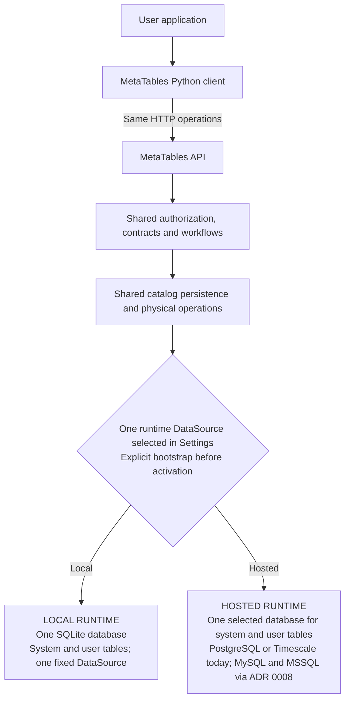

# ADR 0001: One API execution path with SQLite for local development

> Amendment (2026-10-01): [ADR 0013](0013-application-owned-migrations.md) establishes application-owned
> client Alembic execution using the configured environment connection. Its DDL
> privileges belong to the environment database role. It supersedes this ADR's
> conflicting application-migration execution and credential restrictions;
> governed API operations and MetaTables system migrations remain separate.

Date: 2026-09-28

Status: Accepted.

Owner: MetaTables API. Scope: runtime binding, storage and bootstrap, with shared
client/API execution constraints.

Client endpoint selection is governed by
[client ADR 0003](../client/0003-api-endpoint-resolution.md). Its endpoint cache
does not cache this API's runtime context or select its runtime mode or DataSource.

Updated 2026-09-28: application Environment policy and relationships are removed.
Amended 2026-09-29: one enforced runtime binding and explicit bootstrap select one
database for system and user tables.

Companion decision: [Main Sequence SDK ADR 0035: Independent Git source and platform execution context](https://github.com/mainsequence-sdk/mainsequence-sdk/blob/metatables_removal/docs/adr/0035-independent-git-source-and-platform-context.md).
The SDK prerequisite is implemented on `metatables_removal`; the current local
checkout includes the authorization-boundary correction and remains the development
dependency until these interfaces are published.

**Security supersession:** [ADR 0002](0002-application-administration-and-table-ownership.md)
replaces creator/configurator administration with platform admin admission and
previously blocked direct application migration connections. [ADR 0013](0013-application-owned-migrations.md)
restores client execution with configured runtime credentials. System bootstrap migrations remain separate.

**MySQL and MSSQL follow-up:** [ADR 0008](0008-mysql-mssql-table-workflows.md)
requires complete system-schema creation, migrations and table workflows for both
engines. It also supersedes permission to execute against additional registered
DataSources: each runtime has one selected execution source; other registrations
are Settings candidates. External table registration preserves external
ownership in the selected database. Shared workflow ownership, transaction ownership
and first-bootstrap recovery are specified there. ADR 0008 implements these changes through the shared `DatabaseBackend` contract
and the five-engine Compose test matrix. Its engine support and recovery rules
supersede the connection-only behavior recorded below.

## Context

**Credential storage follow-up:** [ADR 0009](0009-shared-credential-store.md) is
implemented. Local DataSource credentials now use encrypted catalog records
with cross-platform external keys. Hosted credentials remain managed SDK Secrets
behind the same CredentialStore contract. Runtime binding and explicit system
migrations remain.

MetaTables has an installed Python client and an API. The client authors table
contracts, runs producers, and consumes published tables. The API owns catalog
state, permissions, lifecycle admission, and physical data access.

Before this decision, local API mode changed authentication and DataSource lookup but still
required a PostgreSQL catalog. Its physical-source fixture provider accepted only
explicit loopback PostgreSQL or Timescale sources. Separately, client-side SQLite
and DuckDB adapters bypassed the API for some reads, writes, and deletes. Other
operations continued through HTTP, and local storage also changed validation and
incremental filtering. These were different execution paths with inconsistent
semantics.

The desired development workflow is to use the same library and API on a branch
such as `test`, without connecting to platform databases. The branch need not be
registered in Main Sequence. Both the local API catalog and application tables
must use one SQLite database. DuckDB support will be removed until its intended use is
defined separately.

This decision replaces client-side local storage and the PostgreSQL-only local
API requirement. The guides and examples describe the implemented shared path.

## Decision

### One local runtime across branches (amended 2026-09-30)

MetaTables owns one persistent local SQLite runtime for a checkout. Git branches,
refs and commits do not select different databases. The deployment saves one
`local` selection and reuses its existing file, DataSource UID, catalog, encrypted
credentials, application rows and logs. The SDK continues to provide identity and
Git facts; this change requires no Main Sequence SDK implementation changes.

Legacy selection recovery adopts the complete selected database, preserving its
storage marker and IDs. One unambiguous legacy selection can be promoted to
`local`; multiple legacy files require choosing the intended existing file.
Never initialize an empty replacement silently. Bootstrap no longer copies saved
DataSource metadata without its credential records. Already orphaned references
require recovery of the matching credential. Old files are not deleted or merged
by startup or migration. This supersedes the previous branch isolation policy.

### Explicit runtime bootstrap in the selected DataSource (amended 2026-09-29)

This amendment supersedes the separate catalog connection, the two-file SQLite
binding, automatic local catalog upgrades, and the requirement that switching to
Hosted already have a migrated catalog. It corrects this ADR's runtime lifecycle;
it does not introduce a second execution architecture.

Settings selects the runtime mode and its DataSource. That database contains both
MetaTables' system tables and user tables. Local selects one persistent SQLite
file; Hosted selects PostgreSQL/TimescaleDB. MySQL and MSSQL remain connection-only
registrations, not supported runtime databases. No SDK change is required.

Both modes execute the same bootstrap state machine. Connection configuration is
held in API memory before catalog access. The API inspects the packaged Alembic
history and required schema. On an empty or outdated database, the user explicitly
chooses **Run MetaTables migrations**. Only after migration succeeds is the proposed
configuration inserted as the runtime DataSource in that database. Failed work
never activates a partially initialized runtime. A database already initialized
and compatible can be selected without running migrations.

Settings, runtime context, mode selection and bootstrap actions do not depend on
catalog sessions or catalog memberships. They retain the existing request admission.
The caller who configures a pending target controls its initialization; an existing
runtime registration's creator controls replacement. Application operations remain
unavailable until activation. Reconfiguration requires a quiescent runtime; active
updates, migration leases and unresolved operations prevent it.

Persist only the selected source's public configuration and Secret references after
activation, in private runtime selection state, so a restart can locate its own
registry. Never persist resolved credentials there. Local workspace discovery can
prefill SQLite. Startup may re-open a previously initialized selection after schema
verification; it must never run Alembic. Ordinary source management cannot retarget,
disable, delete or replace the active runtime registration.

The system migration history uses `metatables_catalog_version`, separate from each
user migration provider's version table. System table names are reserved in the
runtime database. Local physical operations borrow the request's SQLite transaction
through the connection adapter to avoid two writers deadlocking on the same file.
Their savepoints never commit or roll back unrelated catalog work.

Earlier development stores are not automatically combined or overwritten. They
require recreation from the current schema baseline. The old configuration
variables cannot silently select a second catalog or physical database.

Acceptance: fresh local and hosted targets expose Settings before catalog creation;
inspection performs no DDL; only the explicit action migrates and registers the
source; existing compatible targets activate without DDL; failures and incompatible
revisions remain blocked; a restart never upgrades; normal table workflows use the
same selected database across Git branches.

The remaining sections describe the decision with this amendment applied.

### Development migration baseline (amended 2026-09-29)

The application is still in development. Replace the accumulated system migration
chain with one frozen revision, `0001_initial`, that creates the current schema
directly. This supersedes earlier upgrade, collision-reconciliation and local-store
adoption requirements in this ADR. Remove their implementations and tests; verify
the current schema and its constraints on fresh SQLite and PostgreSQL databases.

Existing development databases require recreation through Settings using an empty
database. Startup must not reset, stamp or alter an earlier store automatically.
User application migration histories are independent and remain unchanged. Future
system schema changes add revisions after this baseline.

Settings provides an explicit **Destroy local database** action to recreate a
development workspace. It requires confirmation of the current path and removes
only files marked for that workspace, including its retired adjacent two-file layout.
The action uses existing runtime admission and ownership rules, closes connections,
clears only the local selection, and leaves the runtime awaiting explicit migrations.
Hosted mode, unmarked or foreign files, symlinks and active work are rejected.
This action does not introduce automatic deletion on startup or a mode change.

### Deployment capability and supervised selection (amended 2026-09-29)

This amendment supersedes environment-variable selection of runtime mode.
`configuration.yaml` is authoritative for non-secret deployment capabilities.
`local_mode_available` is a strict boolean, defaulting to false when no file is
present. Environment injection cannot enable this capability or select a mode.
The development checkout enables it; shared deployments disable it.

One developer launcher runs one Vite site and one API worker on the same ports
across mode changes. When the capability is enabled, Settings offers Local and
Hosted. Selection is developer state in ignored `.local/runtime-selection.json`,
separate from the committed YAML. A fresh developer session defaults to Local.
Ordinary hosted deployments have no runtime-switching control surface.

The API never changes a live runtime binding. A switch validates the target,
rejects active requests, unfinished updates, reserved migrations and unresolved
physical operations, then stops admitting application requests. The supervisor
waits for the old worker to exit before starting its replacement. Selection is
persisted only after successful startup. Failed activation restores the previous
worker and reports the failure. No worker overlap or automatic data transfer
between runtimes is allowed. Either mode can start uninitialized and expose the
same Settings bootstrap flow before admitting application operations.

API-issued migration connections hold the developer runtime until the client
releases them, including migrations of already-active tables. The CLI releases
these holds after its command and finalization finish; programmatic users close
the returned connection descriptor after disposing their database connections.
Holds do not expire on a timer: a long migration must not lose its runtime.
After a crashed client, stop its database work before restarting the launcher.
Arbitrary database work using independently obtained credentials is outside this
admission protocol.

The loopback developer transport uses the existing SDK developer identity and
private launcher token in both storage modes. This is scoped to a supervised
developer process, not shared hosted ingress, which keeps SDK caller assertions.
SDK Environment requirements remain unchanged on operations that require them.
The supervisor passes mode and transport parameters explicitly to the child;
`METATABLES_LOCAL_RUNTIME` has no authority. Database credentials remain private
deployment inputs and are never stored in YAML or sent to Vite.

The runtime descriptor reports capability, switching availability and a fresh
instance identity. Admin requests carry that identity so stale requests are
rejected after a restart. During transition the UI blocks work, reloads runtime
context and remounts cached views. A mode change affects the entire developer API
instance, never an individual user's view of a shared service.

### Enforced runtime binding (amended 2026-09-29)

This amendment supersedes statements that SQLite is merely the local default or
that local DataSource registrations can select remote storage. Runtime mode binds
system tables and the runtime DataSource together in one database. It does not create another
implementation of table workflows or change SDK behavior.

- Local mode binds exactly one workspace SQLite DataSource containing system
  and user tables. The source UID, engine, canonical file path, writable
  access and default selection are fixed. Ordinary source management is read-only;
  Settings owns initialization and selection. Registration, replacement, disablement, removal and
  connection-validation mutations are rejected locally.
- Hosted mode binds one selected DataSource for system tables and application
  operations. PostgreSQL/TimescaleDB are implemented runtime choices; ADR 0008
  adds complete MySQL/MSSQL support. Other saved registrations are candidates
  for explicit Settings selection, not additional execution bindings. This
  ADR 0008 amendment replaces the earlier allowance for additional physical
  sources. Hosted SQLite remains rejected at source resolution and management
  boundaries, including records introduced outside the public registration API.
  Hosted mode cannot use local SQLite migration connections.
- The common DataSource provider validates the binding before returning metadata,
  resolving Secrets or opening physical connections. Explicit UIDs, defaults,
  validation and migration requests obey the same policy. The runtime descriptor
  reports the enforced selection rather than an independently mutable default.
- One immutable local scope marker binds the runtime file to its workspace.
  Selecting a file belonging to another workspace fails. Earlier two-file stores
  require recreation from the current baseline; originals remain untouched.
- Local startup checks the registry and catalog source references. A remote
  registration, changed SQLite path/default or foreign source reference causes
  activation to fail while Settings remains available. These checks repeat when resolving sources so later
  catalog changes cannot bypass the binding.

The operation journal and recovery protocol remain shared. SQLite physical work
borrows the request transaction using savepoints; PostgreSQL physical operations
retain their existing connection lifecycle. Neither adapter selects an independent
database for the runtime source.

### Application-owned DataSources (amended 2026-09-28)

The owner approved a breaking extraction of DataSource registration and connection
configuration into MetaTables. This supersedes every earlier requirement for SDK
DataSource lookup or a platform runtime-connection endpoint in this decision.

The catalog stores source identity, engine, public connection configuration,
credential Secret references, creator User UID, storage access mode and default
selection. Source management belongs to its creator; table access continues to use
existing table/namespace grants. No Organization or Environment column, constraint,
selector or policy is introduced. Sources referenced by tables or migration state
cannot be deleted. Deleting a source never deletes a platform Secret or physical database.

Passwords and private TLS material use ordinary platform Secrets through the SDK.
The API resolves values in its own SDK context when opening a connection. Secret
operations retain their existing Environment requirement. Local SQLite uses no
platform Secret and works on an unregistered branch. Credentials are neither
returned in source responses nor persisted as plaintext in the catalog.

Explicit bootstrap registers the selected runtime source after system migrations
succeed. The registry can retain other connection candidates; under ADR 0008,
application execution remains bound to the selected source. Registration of an
existing table preserves its external ownership and does not create or migrate
the physical object. SQLite, PostgreSQL and TimescaleDB support table workflows.
Amended 2026-09-28:
MySQL and MSSQL additionally support source registration, configuration and bounded
connection validation through the same management endpoints. Typed engine
configurations and the database constraint admit both. The MySQL Python driver is
optional; pyodbc is a core package dependency and MSSQL still requires Microsoft
ODBC Driver 18 on the API host. Credentials remain ordinary
platform Secret references; SDK behavior does not change.

MySQL and MSSQL table adapters are not implemented. Their table capability sets
are empty, default selection is rejected, and both documentation and the Admin
site state this limit. Connection validation does not grant table capabilities.
DuckDB remains unsupported. The initial schema admits these supported engines
directly through its engine constraint.

Hosted database provisioning is discontinued. No allocation, billing, provider
lifecycle or special DataSource credential service is ported into MetaTables.
Legacy platform table APIs impose no backwards-compatibility requirement on this
extraction. Platform Secrets and their generic infrastructure remain supported.

### One execution path

Local and hosted use the same client resources, HTTP endpoints, application
services, contracts, authorization rules, producer orchestration, readers, and
migration lifecycle. Runtime configuration chooses connection material and a thin
database communication/dialect adapter. It must not choose another implementation
of MetaTables workflows.

The two terminal boxes are mutually exclusive runtime configurations of the same
API implementation. Each box contains both storage roles; catalog and application
storage have no independent local/hosted selectors. A PostgreSQL catalog with
local SQLite tables, or a SQLite catalog with hosted tables, is invalid. Hosted
MySQL and MSSQL registrations support connection management only, as defined above.
The runtime choice supplies connection material and database/dialect adapters;
it does not branch the shared workflows. The common operation journal and
recovery protocol remain in use.

Under ADR 0008, registered connection candidates never select another physical
target within a request. Changing the runtime selection opens that target's own
system and application tables; it does not transfer a catalog or migrate data
between DataSources. The new engine implementations use the same shared bootstrap
and recovery service, including the progress protocol before the full catalog exists.

All ordinary application-data reads, writes, introspection, statistics, and
deletes go through the API. Client code must not open a database because a
DataSource reports `sqlite`, and updaters must not acquire a second persistence
implementation for local mode. The shared schema-migration connection workflow
is defined below; it applies to both databases.

### SDK and MetaTables responsibilities

| Owner | Responsibility |
| --- | --- |
| Main Sequence SDK | Authentication, authenticated identity, generic Git source context, optional platform branch resolution, and platform Secrets. |
| MetaTables API | Effective DataSource selection, local storage binding, catalog, grants, contracts, lifecycle, physical execution, and database adapters. |
| MetaTables client | Authoring, common HTTP resources, producer logic, readers, and the common Alembic command workflow. |

SDK ADR 0035 is an implementation prerequisite. MetaTables consumes those public
SDK interfaces instead of implementing another Git/platform resolver. No
database engine, local DataSource policy, or MetaTables runtime mode is added to
the SDK.

### Authorization boundary

Platform ownership and membership policy belongs exclusively to the platform
backend. Neither MetaTables nor the SDK implements Organization authorization.
MetaTables has no Organization model, ownership column, membership gate, index,
constraint, request context, or runtime requirement. SDK backend resource fields
remain response data; MetaTables does not copy them into its own models.

MetaTables authorizes its own table and namespace operations using authenticated
User/Team identities, explicit resource grants in the connected catalog.
Local workspaces use separate SQLite files. Per-table deletion protection remains. Missing membership rows are not an application admission gate.

Catalog uniqueness uses DataSource/schema/table physical identity, catalog-wide
idempotency key, and catalog-wide label names/slugs. The initial schema creates
these constraints directly, without retired ownership columns or membership state.
This corrects the earlier Organization requirements in this ADR in place, while
preserving independent SDK Git discovery and unregistered-branch development.

### Catalog identity without platform Environment policy

MetaTables has no Environment model, relationship, selection, authorization
predicate, deletion policy, or public scope field. This supersedes the earlier
Environment requirements in this decision. No replacement tenant/scope model is
introduced. SDK identity and Secrets remain opaque integration
boundaries; MetaTables does not inspect their platform policy metadata. This
change requires no SDK implementation changes.

Namespace names, nonempty table identifiers, and operation idempotency keys are
unique in the connected catalog. Physical identity remains DataSource/schema/table.
Catalog transactions serialize mutations using a catalog lock. Authenticated
user/team grants authorize resources directly. Local Git discovery and support
for unregistered branches are preserved, sharing one local runtime across branches.

The initial schema implements these keys and per-table protection directly.
It contains no Environment columns, constraints, indexes or policy tables.

### Local defaults and storage

`configuration.yaml` enables local development with `local_mode_available: true`.
The supervised launcher selects a saved developer mode, defaulting to Local, and
the standalone CLI selects Local explicitly with `--local`. Environment values
cannot select the mode. Both entrypoints supply the loopback listener and private
token; SDK identity and catalog grants remain required.

The local launcher prefills one persistent `metatables.sqlite` file in an
application-owned directory scoped to the checkout/workspace and canonical
repository. Git branch, ref and commit SHA are provenance only. Restarting or
switching branches reuses the same selected database and its existing identities.

The storage directory supplies the default path. Settings can select a different
SQLite file for the whole runtime. The API never falls back to a platform source
when that file is unavailable. Retired independent catalog/table overrides fail
explicitly rather than selecting another database.

The API owns a stable local workspace UID for file binding and a local DataSource
UID for storage identity. Neither is registered through platform APIs. SDK login
and authenticated User identity remain required. MetaTables operations do not
select or require a platform Environment.

A local API process is bound to its selected workspace and source snapshot.
Clients must match that context. Branch/source changes require the documented
restart workflow; they must not silently retarget an existing
producer or connection pool. Existing loopback admission, private-token checks,
and catalog authorization remain in force.

### Effective runtime context

Provide one authenticated API runtime-context descriptor for both modes. It
contains Git provenance when applicable, effective
DataSource metadata, dialect, parameter style, and default schema. It excludes database
secrets. Hosted configuration obtains platform-owned values through the SDK;
local configuration supplies its own storage binding using SDK identity/source
facts.

Authoring defaults, registration, migration target resolution, updater binding,
and readers use this same effective context. A local-only source UID must never
trigger an SDK directory lookup. A missing platform branch or its missing
`metatables_data_source_uid` must not block the local workflow. Explicit source
selection is validated against the active API context. Cache keys include API
and storage identity, not only the process ID.

### Thin database adapters

Share operation preparation, contract validation, permission checks, lifecycle,
query construction where portable, result envelopes, and recovery logic. Limit
adapter differences to connection lifetime, SQL compilation and parameter
binding, database introspection, transaction/locking primitives, and unsupported
database capabilities. Do not copy the PostgreSQL application services into a
parallel SQLite service tree.

The SQLite adapter must operate on migrated contracts. It must not infer, create,
or alter a managed table during ingestion. Its existing client-side adapter is
not suitable unchanged because its `_ensure_table` performed those actions.

SQLite connections must enforce foreign keys and have explicit transaction,
busy-timeout, connection-lifetime, and write-serialization behavior. The shared
catalog mutation lock contract needs a SQLite implementation; a test-only no-op is
insufficient. Physical operations in the shared file borrow the request transaction
and isolate their work with savepoints.

The supported type/schema contract must cover UUIDs, booleans, nulls, numeric
precision, UTC timestamps and time-index precision, unique grain indexes,
foreign keys, pagination, and default-schema normalization. Unsupported named
schemas, data types, SQL constructs, or migration operations fail explicitly
before effects occur. SQLite does not advertise PostgreSQL roles, Timescale
extensions, hypertables, compression, or retention policies.

### SQL and migrations use the same workflow

Extend the compiled-operation contract with SQLite dialect and parameter binding.
The client compiles against the effective DataSource's advertised dialect using
the common helper and request envelope. The API validates that dialect against
the selected source. Arbitrary PostgreSQL SQL is not translated into SQLite SQL.
Examples that use dialect-specific inserts must use the common dialect-aware
helper rather than a second local tutorial implementation.

Keep one application migration workflow for both databases:

1. The client resolves the effective API context and migration provider.
2. The API authorizes and reserves the registry and managed table resources.
3. The API supplies a scoped migration target for its effective DataSource.
4. The same client-side Alembic runner executes the provider revision against
   that target through the appropriate connection/dialect adapter.
5. The API introspects, validates, and finalizes the reserved resources.

This retains the existing shared Alembic execution location. PostgreSQL may
require scoped credentials and owner-role handling; SQLite uses the API-selected
local file on the same host and has no database roles. These differences belong
in the migration connection adapter. Connection details are returned only by
the authorized migration-target operation, not the general context descriptor.
The local launcher and migration client therefore require the same filesystem
view of the selected file.

There is no local-only API Alembic runner, separate schema-creation shortcut, or
`create_all` alternative. If migration execution location changes later, that
requires a decision applying consistently to both adapters. Catalog migrations
remain a separate history, executed only through the explicit common bootstrap
action against the selected runtime database.

### Remove DuckDB and the client storage bypass

Delete the DuckDB adapter and its Parquet/object-store/UI paths, loaders, source
constructors, aliases, exports, dtype mappings, dispatch branches, and associated
support tests. Remove the DuckDB/PyArrow optional extra where those dependencies
exist solely for this adapter. Remove its supported-capability entries, guide
instructions, example variants, generated copies, and skill guidance. Historical
decision records may explain the removal without advertising support.

Once API-owned SQLite replaces the remaining client path, remove client storage
factories and `SessionDataSource.set_local_db` behavior. Eliminate source-type
exceptions in validation, serialization, incremental filtering, persistence,
reads, statistics, and deletion. Do not retain aliases that silently select
SQLite when DuckDB is requested, or delete users' existing database/Parquet files
as a side effect of removing code. “Branches” here means conditional code paths,
not deletion of Git branches or repository history.

## Alternatives considered

- Removing DuckDB while leaving client-side SQLite would preserve two execution
  paths and is insufficient.
- Changing only the local DataSource default would leave PostgreSQL-only
  connections, SQL, migration responses, and client source resolution broken.
- Copying API workflows for SQLite would duplicate lifecycle and permission
  logic and allow their behavior to drift.
- Registering fake platform branch/source records or adding a MetaTables-only
  SDK bypass would put context policy in the wrong project.
- A local-only migration runner would split schema behavior; this decision
  retains one runner with database-specific connection adapters.

## Consequences and compatibility

Removing the client adapter helpers and the optional extra is a breaking public
change. Release notes must identify removed interfaces and point users to the
local API workflow. No automatic migration of existing file-adapter data is
promised. Preserve the current SDK prerequisite until the companion interfaces
are available in a published dependency.

The common path reduces semantic divergence, but SQLite is not a PostgreSQL
emulator. Optional database features are resolved at runtime against the selected
DataSource by its backend; existing roles and grants authorize operations. Authenticated
local development does not imply fully offline authentication or access to
platform resources without their required context.

## Implementation order

1. Implement SDK ADR 0035 on `metatables_removal` and its context tests.
2. Remove DuckDB's complete supported surface and verify distribution contents.
3. Add API-owned local context, branch-independent SQLite defaults, and effective
   source discovery; update the common client context consumers.
4. Implement SQLite communication/dialect adapters for shared catalog and
   physical operations, compiled SQL, locking, and migration targets.
5. Remove the client storage bypass and local-only validation exceptions.
6. Update architecture, runtime guides, examples, skills, capability inventories,
   and generated references after the behavior is implemented.

## Acceptance criteria

- SDK access decisions come only from backend responses; no ownership preflight
  or expected-Organization argument is required by MetaTables.
- Current catalog models, constraints, API responses, client models, workspace
  identity and migration roles have no platform ownership or Environment dimension.
- Fresh catalogs match the current models, including physical keys, label keys,
  namespace names, table identifiers and idempotency constraints.
- Earlier incompatible schema baselines remain untouched and require recreation;
  compatible local databases retain their data across Git branches.

- A fresh unregistered `test` branch starts the local API with no PostgreSQL
  service, physical-source fixture file, or platform branch/DataSource creation.
- The real client/API tutorial performs reserve, Alembic migration, finalize,
  seed, producer execution, and independent reads: three assets, 69 prices, and
  66 returns. Repeating the run and restarting preserve the expected rows.
- Different branches reuse the same local database, source IDs and credentials.
  Explicit local overrides route every operation and migration consistently.
- One parameterized behavioral suite exercises both database adapters through
  the same services and client operations. Only database provisioning and the
  adapter configuration differ.
- Local integration tests reject platform physical-credential retrieval and
  PostgreSQL connections. SDK authentication/context can be stubbed at their
  boundary; catalog and physical execution must be real SQLite operations.
- Tests cover permissions, uniqueness, foreign keys, precision, incremental
  boundaries, concurrency, capability failures, and operation recovery.
- Ordinary client operations cannot open local database files. The common
  authorized Alembic migration connection is tested separately for both engines.
- Hosted PostgreSQL/Timescale behavior continues to pass its relevant checks;
  removed DuckDB modules and extras are absent from clean distributions.
- Documentation builds and boundary checks pass, with no second local workflow
  presented as a supported alternative.

## Implementation and verification

The authenticated `/runtime-context/` endpoint supplies both clients with their
effective DataSource. Local mode uses SDK Git source facts and does not
resolve or register a platform branch. The client does not cache effective
context globally, so changing API or storage cannot reuse an old source binding.

`METATABLES_LOCAL_STORAGE_DIR` selects the default parent directory. Settings
selects the single runtime file. Independent catalog/table overrides are retired.
An atomic scope marker prevents selecting another workspace's database; older
development stores remain untouched and require recreation.

Both SQLite catalog mutations and table writes use explicit `BEGIN IMMEDIATE`
transactions with foreign-key enforcement and a 30-second connection busy timeout.
Bounded physical operations select a 5-second lock timeout. The
catalog uses WAL. Application DDL uses the same Alembic reservation/finalization
workflow as PostgreSQL. SQLite rejects named schemas, exact decimal, unsigned
64-bit integer, array, PostgreSQL JSONB, and specialized index contracts.
Timestamps require UTC offsets and preserve microseconds; finer precision is
rejected rather than truncated. UUID coordinate filters use the same contract
conversion for reads and deletes.

The breaking removals include `metatables.local_data`,
`metatables.code_repository_data_source`, the `local-data` extra,
`DataSource.create_duckdb`, `DataSource.get_or_create_duck_db`,
`DataSource.insert_data_into_local_table`, `DataSource.get_earliest_value`,
`SessionDataSource.set_local_db`, and the old storage-type constants. Use the
local API and its effective DataSource instead.

The authorization correction removes Organization fields and membership admission
from current catalog models, request context, providers, and client responses.
`DataSource` is a MetaTables API projection, without inherited SDK directory or
runtime-connection methods. DataSource registration and connection resolution belong exclusively to this API.
Environment fields and `scope_kind`/`scope_uid` are removed from API and client
models. Git provenance is present only for local workspace validation.

The single revision `0001_initial` creates all current system tables without
platform ownership or Environment fields. SQLite migrations suspend foreign-key enforcement outside
the transaction while rebuilding tables, validate references before commit, and
restore enforcement afterward. This avoids cascading data loss during a table
rebuild. SQLite and PostgreSQL tests verify schema parity, constraints, foreign-key
actions, repeated upgrade, and downgrade/recreation while preserving the independent
user migration history. Earlier incompatible development schemas require the
documented baseline procedure. Compatible legacy local files are adopted intact
under the single-runtime amendment above.

Verification uses real HTTP, migrated catalog databases, and physical tables:

- The same tutorial suite runs against SQLite, an explicit SQLite file override,
  and PostgreSQL, including restarts, migration reservation/finalization,
  producers, independent readers, uniqueness, foreign keys, and tail deletion.
- Branch switching preserves one database, its source IDs and credentials. Local tests
  fail if platform physical credentials, DataSource lookup, or PostgreSQL
  connections are attempted.
- SQLite tests exercise overlapping concurrent writers, rollback after failed
  replacement, UUID selections, timestamp precision, and absent-table failure
  without schema creation.
- Dependency-boundary, documentation, generated-reference, and clean package
  checks guard the retired surface and the shared client/API path.

SDK identity and hosted ingress verification are stubbed in the behavioral
suite; the tests do not claim a live platform login or Timescale extension run.
The existing PostgreSQL service and authorization suites remain part of the
required test run.

## Related material

- [Current architecture](../../concepts/architecture.md)
- [Current local runtime](../../operations/local-runtime.md)
- [Migration workflow](../../client/define-and-migrate-tables.md)
- [Executable tutorial](../../client/tutorial.md)
- [SDK ADR 0034: SDK ownership boundary](https://github.com/mainsequence-sdk/mainsequence-sdk/blob/metatables_removal/docs/adr/0034-remove-metatables-from-sdk.md)

SQLite, PostgreSQL and TimescaleDB support table operations. MySQL and MSSQL
registrations support connection management only and cannot be runtime databases.

## Database access amendment (ADR 0007)

[ADR 0007](0007-database-enforced-table-access.md) supersedes this decision's
earlier support for registering views. Registration accepts ordinary and
partitioned tables with the required database access safeguards. Database setup
creates the protected catalog and initializes native caller permissions. Local
SQLite uses its engine authorizer behind the same backend access contract.
