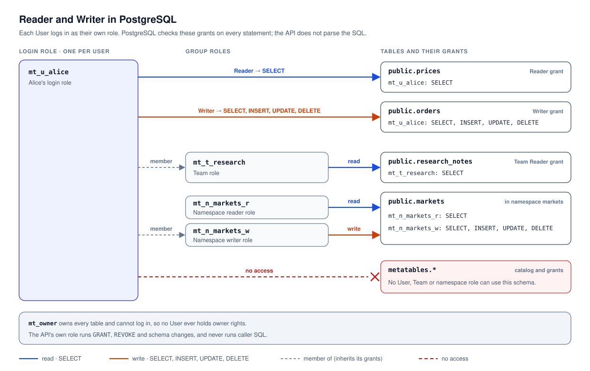
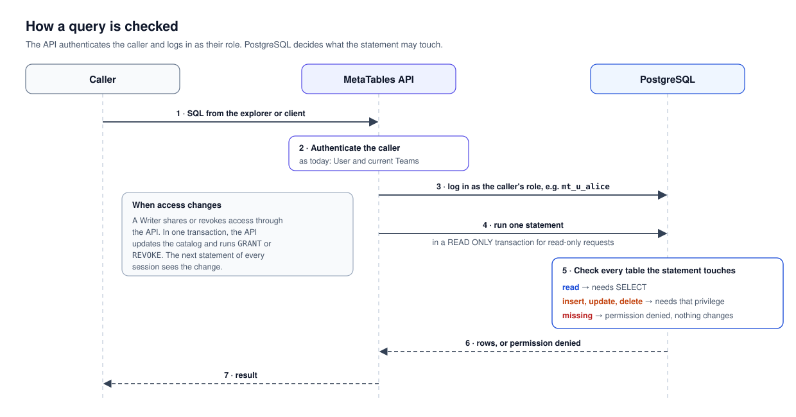

# ADR 0007: Enforce table grants in the database

> Amendment (2026-10-01): [ADR 0013](0013-application-owned-migrations.md) establishes application-owned
> client Alembic execution using the configured environment connection. Its DDL
> privileges belong to the environment database role. It supersedes this ADR's
> conflicting application-migration execution and credential restrictions;
> governed API operations and MetaTables system migrations remain separate.

Date: 2026-09-29

Status: Accepted.

Implementation status: implemented and verified on all five supported engines.
The API uses the backend access contract for caller sessions, permission mirroring
and repair; the Python client and examples use DataSource-only SQL requests.

Owner: MetaTables API.

Clarified 2026-10-01 (MetaTables #9): automatic compiler source resolution must
preserve the selected runtime's restricted SQL identity. An explicit different
source UID is not SQL admission, even with `operation=select`; return a specific
source-policy conflict rather than claiming the database is unavailable. ADR
0010's registered-table reader remains the supported external read path. General
external SQL requires a separate permission design that preserves caller grants
without using the source's shared account as an unrestricted SQL identity.

Related decisions: [API ADR 0001: Unified API storage](0001-unified-api-storage-and-local-sqlite.md),
[API ADR 0002: Administration and table ownership](0002-application-administration-and-table-ownership.md)
and [API ADR 0008: Database backend contract](0008-mysql-mssql-table-workflows.md).

Accepted follow-up, 2026-09-30: [ADR 0012](0012-bounded-data-transfer-and-safe-retries.md)
specifies concurrent admission, bounded fetching, and safe transfer retries while
preserving database-enforced access and verbatim SQL. The follow-up is implemented with local verification; hosted engine verification
of the new transfer behavior remains pending.

## Context

MetaTables has two table access levels, Reader and Writer (ADR 0002). Before this
decision, the API alone enforced them. It checked the caller's grants, then ran
every query as one database user that owned every managed table and the catalog,
including the grant tables.

Caller-written SQL relied on an API parser that allowed a small subset of SQL.
That subset rejected common queries such as `LATERAL`, `string_agg` and `EXPLAIN`,
and a parser mistake would run with full database access. A query explorer needs
arbitrary SQL, so the database itself must enforce Reader and Writer.

## Decision

### SQL authorization belongs to the database backend

Caller-written SQL is authorized exclusively by the selected database backend's
enforcement mechanism. The API performs no SQL authorization analysis: it does
not parse or classify the statement, discover affected tables, or consult a
function allowlist to decide whether that statement is allowed.

The shared request path identifies the caller, obtains a restricted execution
session from the bound `DatabaseBackend`, and submits the SQL. PostgreSQL, MySQL
and MSSQL enforce access through their database security mechanisms; SQLite uses
its engine authorizer callback behind the same contract. Every operation retains
the runtime's one selected DataSource binding. On adoption, this decision replaces
SQL authorization analysis in ADR 0008's SQL facet; other backend obligations
remain in place.

Database initialization and schema management establish and preserve the
permissions required for this guarantee. These responsibilities do not introduce
per-query object inspection. The catalog remains the authority for grants, and
the API continues to authorize sharing, schema changes and table lifecycle
operations. Request limits and transaction handling remain API responsibilities.

### Reader and Writer are PostgreSQL privileges

| MetaTables access | PostgreSQL privilege on the table |
| --- | --- |
| Reader | `SELECT` |
| Writer | `SELECT`, `INSERT`, `UPDATE`, `DELETE` |

Each principal is a PostgreSQL role:

| MetaTables principal | PostgreSQL role |
| --- | --- |
| User | Separate read and write login roles per User |
| Team | A group role whose members are the roles of the Team's current members |
| Namespace | A reader role and a writer role. The namespace's tables are granted to them, and a namespace grant makes a User or Team a member |

Sharing a table runs `GRANT`; revoking access runs `REVOKE`. The API issues them in
the same transaction that changes the catalog, so the catalog and the database
always agree. The catalog remains the source of truth.

*Figure 1. Reader and Writer grants as PostgreSQL privileges.*

Writer still means full control of a table in MetaTables. Schema changes, deletion
and sharing remain API operations; in the database, a Writer can only read and
change rows. Write privileges are withheld while a table is reserved, on read-only
DataSources, and on a migration provider's version table, which only API migrations
change.

### PostgreSQL checks every query

*Figure 2. The API chooses the role; PostgreSQL decides.*

The API authenticates the caller as it does today, then connects to PostgreSQL as
the caller's login role, using a password it derives from the runtime DataSource's
password Secret. Domain-separated HMAC derives independent passwords for each
runtime, User and execution mode. Passwords are never stored in the catalog or
returned to clients. The hosted DataSource therefore requires a password Secret;
the existing connection configuration supplies it, with no new environment variable.
PostgreSQL enforces the caller's effective privileges, including table access
through subqueries and routines executing with the caller's privileges. The
database permissions described below prevent caller SQL from gaining an owner's
privileges through an application routine. The API does not parse or classify
the SQL.

The login role must be the caller's own role. A shared login that switches Users
with `SET ROLE` is not safe: caller SQL can switch to another User's role with
`set_config('role', …)`.

Each request sends exactly one statement through PostgreSQL's extended query
protocol, which rejects a second statement such as `COMMIT; DELETE …`. Read-only
requests run in a `READ ONLY` transaction. The API cancels queries that exceed
their time limit, because callers can change their own timeout settings.

### The API stops inspecting SQL

Client upgrade clarification, 2026-10-01: removing `MetaTableOperationScopeTable`,
`MetaTableOperationScope` and `scope_tables` is intentional. Consuming applications
select a DataSource and remove scope-only helpers and checks; they must not rebuild
this layer through client SQL parsing or per-query catalog lookups. Table lifecycle
registration remains separate. The [legacy application upgrade guide](../../client/upgrade-legacy-app.md)
and packaged `metatables-upgrade-legacy-app` skill document the conversion.

The API removes every check of what the SQL means:

- No SQL parser, function allowlist or table-name rewriting.
- No statement-type check. A request's mode only chooses a `READ ONLY` or
  `READ WRITE` transaction; PostgreSQL rejects writes in read-only mode and any
  statement the role lacks privileges for.
- No declared table scope. A request names only its DataSource.
- No checks for views, triggers or cascades before query execution. Registration
  and schema management establish and preserve the safeguards and foreign-key
  rule below, without inspecting each submitted query.
- One statement per request comes from the extended query protocol, and row limits
  from fetching at most `max_rows` rows, not from rewriting the query.

`execute-operation` and `run-query` use the same path; their `operation` field
only selects the transaction mode. The insert rewrite for server-generated UUID
keys is a client convenience, not a security check, and moves to the Python
client.

### Safeguards

- **Catalog.** Catalog tables live in a `metatables` schema that no User role can
  use. The catalog lock becomes a row lock in that schema, because any session can
  take PostgreSQL advisory locks.
- **Ownership.** Tables are owned by `mt_owner`, a role that cannot log in, because
  an owner holds every privilege. The API's own role manages grants and schema
  changes and never runs caller SQL.
- **Defaults.** PostgreSQL's default `PUBLIC` privileges are revoked: connecting,
  creating objects and temporary tables, and executing new functions.
- **Privileged routines.** Restricted caller roles must not be able to execute
  application routines with elevated owner privileges, including
  `SECURITY DEFINER` routines. Initialization establishes this restriction for
  existing routines as well as future defaults, covering direct grants, inherited
  roles and `PUBLIC`. Revoking a direct User grant alone is insufficient if
  another grant still permits execution. Schema changes and extension installation
  preserve the restriction before exposing new or changed routines to callers.
  Externally owned routines require their owner to supply the necessary privilege
  configuration; registration does not transfer ownership. If the required
  database permissions cannot be established, caller SQL execution cannot be
  enabled. Enforcement during a query is the database's execution-permission
  check, with no API inspection or per-query function allowlist.
- **Registration.** Only ordinary and partitioned tables can be registered,
  because a view runs with its owner's rights. For the same reason, tables whose
  triggers call `SECURITY DEFINER` functions receive no write privileges.

### Limits

- Any role can see the names, columns and row counts of every table in PostgreSQL's
  system catalogs, but not their data. MetaTables accepts this where the explorer
  is enabled. Role names are opaque, because table permissions are visible too.
- PostgreSQL runs foreign-key cascades as the table owner. Where the explorer is
  enabled, foreign keys must use `restrict` or `no action`.
- Heavy queries still consume resources. Per-role connection limits, time limits
  and, optionally, a read replica bound them.

### SQLite

SQLite has no roles. Its authorizer callback applies the same rule in local
runtimes: reads on the caller's Reader and Writer tables, writes on Writer tables
only, and nothing else, including catalog tables, schema changes, transaction
control and `PRAGMA`. The callback responds to SQLite's own authorization events
inside the backend adapter; the API does not parse the query to infer its access.

### Engine-specific enforcement

The backend contract includes an `access` facet for initialization, physical
safeguards, grant reconciliation and caller-session admission. Its catalog-derived
permission graph contains User, Team and namespace roles. Each User has separate
opaque read and write login identities. The read identity receives only `SELECT`;
the write identity receives Writer privileges where the catalog grants them.
Neither identity can assume the other. PostgreSQL additionally uses a read-only
transaction for read requests. Application administration never implies table access.

PostgreSQL keeps catalog tables in `metatables`, application tables in their
registered schemas, and uses the catalog's singleton security row for mutation
locking. Application migrations use a separate connection whose default schema
is `public`; they cannot accidentally create application tables in the catalog.

MySQL has no independent schema namespace within a selected database. Its catalog
tables stay in that database and receive no caller grants. Account and grant DDL
implicitly commits, so the PostgreSQL same-transaction statement above does not
apply to MySQL. A catalog transaction records the desired graph and a durable
pending flag first. Reconciliation installs database permissions and clears that
flag under the catalog lock. SQL admission repairs pending work before opening a
caller session. Admission reacquires the catalog lock after each commit and
rechecks readiness, so it cannot bypass work published by another request during
that interval. Cached identities require no extra catalog commit. Failed or interrupted reconciliation keeps admission closed.
Global mandatory roles are unsupported because they can add permissions outside
the application's graph. MySQL caller roles receive no routine execution grants;
triggered tables receive no write privileges.

SQL Server uses separate logins and database users, User/Team/namespace database
roles, and transactional permission changes. Read identities have no DML grants;
`ApplicationIntent=ReadOnly` is not treated as access enforcement. Application
modules receive no caller execution privileges because ownership chaining can
bypass underlying table permissions. Catalog objects are inaccessible, and views,
synonyms and triggered writes are excluded from caller access.

PostgreSQL's extended protocol, SQLite's single-statement execute operation and
MySQL connections without `CLIENT.MULTI_STATEMENTS` reject multiple statements.
SQL Server accepts a batch as one protocol command. The entire batch runs as the
restricted identity, so transaction control cannot grant additional table access.
A caller-written SQL Server batch can explicitly commit its permitted writes;
the API does not promise atomic rollback for such a batch. Server-generated
table operations retain ADR 0008's transaction guarantees. This is a protocol
difference, not a reason to reintroduce SQL parsing.

All engines execute caller SQL verbatim, bind parameters, bound fetched results,
and cancel at the API deadline. A full result page reports that more rows may be
available without fetching an extra row. PostgreSQL cancellation is independent
of caller-controlled settings; MySQL uses a separate administrative `KILL QUERY`;
SQL Server uses ODBC cancellation; SQLite uses an interrupt and progress handler.

These choices follow the documented [PostgreSQL extended protocol behavior](https://www.psycopg.org/psycopg3/docs/basic/from_pg2.html#multiple-statements-in-the-same-query)
and [MySQL implicit commits](https://dev.mysql.com/doc/refman/8.4/en/implicit-commit.html).

## Alternatives considered

- **Extend the SQL allowlist.** Each extension grows what the parser must get
  exactly right, and a mistake still exposes every table.
- **One shared login with `SET ROLE`.** Caller SQL can switch to another User's role.
- **Row-level security keyed on a session setting.** Caller SQL can change the
  setting.

## Consequences

- The explorer can run any PostgreSQL query, and the API has no SQL parser left
  to get wrong.
- The DataSource login needs `CREATEROLE`.
- Physical table names become visible to explorer users.
- Cascading foreign keys are unavailable where the explorer is enabled.
- Team membership reaches the database at the pace of the existing one-hour
  platform-fact cache.

## Implementation

Nothing runs in production, so this ships as one change with no transition
period. The same change creates the roles and the `metatables` schema, mirrors
grants, runs every query endpoint as the caller's role, and deletes the SQL
parser, statement-type check and table scopes. A reconciler repairs any drift
between the catalog and the database.

Existing development databases are recreated through Settings, as ADR 0001
describes; no data is migrated. The change covers the runtime DataSource; other
PostgreSQL DataSources need a separate decision.

## Verification

The Compose contract suite exercises SQLite, PostgreSQL 17, TimescaleDB 2.22 on
PostgreSQL 17, MySQL 8.4 and SQL Server 2022. Shared scenarios cover Reader/Writer
access, Team membership, namespace deletion, revocation and rollback, protected
catalogs and version tables, triggers, cascading foreign keys, deadlines, and
failed permission repair. PostgreSQL-specific tests cover privileged routines,
inherited and column-level permission drift, and a real TimescaleDB hypertable.
MySQL tests interrupt reconciliation after the catalog commit and verify durable
recovery before admitting SQL.

A PostgreSQL capability test initializes the catalog and managed tables using a
database owner with `CREATEROLE`, without superuser or `CREATEDB`. This verifies the
required privilege contract locally; it does not provision or certify a specific
hosted PostgreSQL service. Providers must expose the privileges documented in the
[DataSource guide](../../api/data-sources.md).

The full regression suite also exercises PostgreSQL 14, real HTTP client tutorials,
SQLite/hosted worker transitions and the Vite proxy. Query routes and server-generated
table operations use committed caller admission. The dependency and AST checks
prevent the removed SQL authorization layer from returning.
