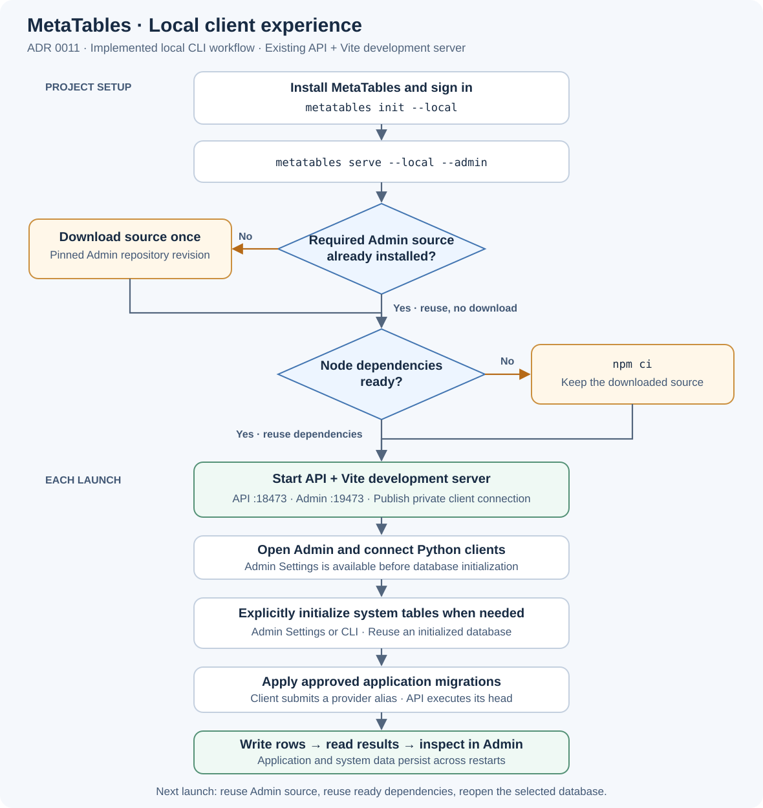

# ADR 0011: Local development from the CLI with a reusable Admin installation

> Amendment (2026-10-01): [API ADR 0013](../api/0013-application-owned-migrations.md)
> supersedes provider approval and API-side application execution in this ADR.
> Applications now load providers and execute Alembic through the client using
> their environment connection. Launcher/Admin installation decisions remain valid.


Date: 2026-09-30

Status: Accepted.

Amended 2026-10-01: both SDK session sources use the developer's saved session
from the machine's credential store, which the Main Sequence CLI and the VS Code
extension share. The API process receives only its backend and reads that
session itself; tokens reach it only on a machine without a saved session.

Implementation status: Implemented. The installed CLI provides project setup,
API/Vite orchestration, managed Admin reuse, local connection selection, runtime
status/initialization and application-owned migrations. Focused checks cover
installation state transitions and the local write/read/restart workflow.

Owner: MetaTables Python client and CLI. MetaTables Admin supplies its existing
Vite development application; the API retains runtime and database ownership.

Related decisions: [ADR 0001: Local API storage](../api/0001-unified-api-storage-and-local-sqlite.md),
[ADR 0002: Administration and ownership](../api/0002-application-administration-and-table-ownership.md),
[ADR 0003: Client endpoint resolution](0003-api-endpoint-resolution.md), and
[ADR 0004: Approved application migrations](../api/0004-approved-application-migrations.md).

## Context

A developer installs `mainsequence-metatable` in their application's Python
environment and wants the same local experience currently provided by the
repository's VS Code launch: the MetaTables API, Admin running through Vite,
persistent SQLite storage, and Python table workflows.

The distribution already contains the client and API. Admin's `scripts/dev.py`
already loads an SDK session, generates the private token, starts the API and
Vite, publishes a client connection file, and stops the services together.
Vite already proxies `/api` and the frontend already supports direct access in
development mode. This is the local runtime to expose through the installed CLI.

The remaining setup assumes two manually prepared source checkouts. The launcher
requires `api/app/main.py` inside its backend directory and a pre-existing Admin
`node_modules` directory. The installed CLI starts only the API. System bootstrap
and application-owned migrations also need supported client commands.

## Decision

The Python CLI owns local setup and process orchestration. It downloads the
[MetaTables Admin repository](https://github.com/mainsequence-projects/MetaTablesAdmin)
at a compatible, immutable revision **only when that source installation is
missing**, installs its Node dependencies when needed, and runs the existing
Vite development server.

A ready installation is reused across launches and consuming projects. Starting
the local environment does not fetch repository updates, download the same
revision again, or rerun `npm ci` when its dependencies are ready. The client
experience uses the current frontend development mode and proxy.

## Client experience



[Open the full-size diagram](../../assets/diagrams/local-client-experience.svg).
The download/dependency branches describe managed installation; `--admin-path`
selects an existing developer checkout instead.

### First project setup and launch

Run from the consuming application's Git checkout, using the Python environment
where MetaTables and the application are installed:

```bash
python -m pip install mainsequence-metatable
mainsequence login
metatables init --local
metatables serve --local --admin
```

The behavior is:

1. `init --local` creates or explicitly updates the project's local configuration,
   including `local_mode_available: true`, without overwriting unrelated settings.
   Rerunning it preserves existing configuration and data. It explains how to
   run the application's own migration provider through the client.
2. `serve --local --admin` validates the Python/SDK, Git, Node/npm, configuration
   and port prerequisites. A missing prerequisite produces an actionable error.
3. The launcher reuses a compatible Admin installation or prepares the missing
   source/dependencies according to the installation rules below.
4. It starts the API on `127.0.0.1:18473` and Vite on `127.0.0.1:19473` by default,
   publishes the private project connection, and opens Admin after both services
   are reachable. Service readiness is separate from database initialization.
5. For an uninitialized database, Admin shows the existing Settings workflow.
   The user explicitly runs MetaTables system migrations. An initialized runtime
   reopens its existing database.

`serve --local` keeps the API-only workflow. Admin setup occurs only when Admin
is requested. `--admin-path PATH` runs an existing Admin checkout and preserves
its source changes; it neither downloads nor updates that checkout. Report missing
dependencies there with the existing `npm ci` instructions.

The existing `--port` option selects the API port; add `--admin-port` for Vite.
The proxy, allowed browser origin and client connection must all use the selected
ports. Conflicts produce an error rather than attaching to an unrelated process.

### Explicit initialization, application migrations, and client use

The public command surface is:

| Operation | Interface | Effect |
| --- | --- | --- |
| Inspect the local runtime | `metatables --local runtime status` | Read bootstrap state, active source, revisions and credential readiness, including before initialization. |
| Initialize or upgrade system tables | `metatables --local runtime initialize` | Call `/runtime-bootstrap/migrate/`, using the same authorization and lifecycle as Admin Settings. |
| Apply an application provider | `metatables --local migrations upgrade --provider ledger.migrations:migration` | Run Alembic in the application process and finalize catalog bindings through the API. |
| Inspect application tables | `metatables --local meta-table list` | Use the running project's local connection. |

The global `--local` selects client transport; the existing `serve --local`
selects the launched API's runtime mode. The client flag loads the project's
private connection through a shared public helper, also exposed to Python as
`metatables.configure_local_client`. It explicitly selects that connection for
MetaTables requests without redirecting SDK platform authentication.

```python
from metatables import configure_local_client

configure_local_client()

from my_application.example import write_and_read

write_and_read()
```

The helper resolves the consuming project's root, validates the connection's
ownership, permissions, loopback target and current launcher identity, and uses
the API's existing Git/runtime checks. An absent, stale or mismatched local
connection produces a local launch error; it never falls back to hosted discovery.
The explicit local selection applies to the operation scope in the CLI and the
configured Python process. Other invocations retain ADR 0003's existing endpoint
precedence, including `METATABLES_API_URL` and hosted discovery.

For execution and authoring, `--provider ledger.migrations:migration` resolves in
the application's Python environment. The selected API supplies its environment
connection and catalog operations. No provider approval or API installation is required.

Provide a consuming-application example that defines its own provider,
creates a small table through that provider, writes rows through the API, and
reads them back. A repeat run must preserve the expected rows. No MetaTables
source checkout or pre-existing table UID should be required.

## Admin installation and reuse

Use a persistent, OS-specific user-data directory, with an installation keyed by
the Admin repository and immutable source revision. For example, macOS can use
`~/Library/Application Support/metatables/admin/<revision>/`. Projects share the
frontend installation, while their runtime configuration and databases remain
project-owned.

Ship compatible Admin revision metadata with the Python distribution. Normal
startup resolves the required revision locally; it does not query GitHub for a
latest branch or update a working installation. A Python package upgrade may
select another revision, which is downloaded only if that revision is absent.
Retain existing revisions so other installed client versions can reuse them.

| Local installation state | Required action |
| --- | --- |
| Required source and compatible dependencies are ready | Reuse both. No source download, Git fetch, registry update check or `npm ci`. |
| Required source exists; dependency installation is absent or incomplete | Reuse the source and run `npm ci`; do not download the repository again. |
| Required source exists; recorded lockfile or Node compatibility no longer matches | Reuse the source and prepare compatible dependencies before launch. |
| Required source is absent | Download the pinned source once, validate and publish it, then run `npm ci`. |
| A download was interrupted before a complete source was published | Retry the missing source installation; a temporary directory is not an installed revision. |
| An installed source is damaged or modified unexpectedly | Report it and require explicit repair; do not silently replace it on every startup. |

Download a source archive over HTTPS; a Git checkout is not required for managed
Admin source. Validate its pinned file-content tree digest and archive paths before publishing
it into the final directory. Record source completion separately from dependency
completion so a failed `npm ci` can retry without another source download. Record
the lockfile identity and compatible Node environment when dependencies succeed.
Directory existence alone is not proof of a completed installation.

Serialize preparation with a per-installation lock and recheck state after
acquiring it. Two launches must not download or install the same revision twice.
An explicit repair/update uses staged preparation and preserves an installation
currently used by another running launcher. Removing Admin never removes project
configuration, credentials or application databases.

Later launches need no Admin download or npm network access while the required
installation is ready. This guarantee concerns frontend installation; existing
SDK authentication and API identity refresh requirements still apply.

## Local runtime composition

| Location | Contents and execution context |
| --- | --- |
| Consuming application's Python environment | Installed MetaTables client/API and application migration providers. Use this interpreter to start the API. |
| Consuming application directory | `configuration.yaml`, Git context, runtime selection and `.local/development-client.json`. This is the API working directory. |
| Managed Admin directory or `--admin-path` | Frontend source, `package-lock.json` and `node_modules`. This is Vite's working directory. |
| Existing API-selected storage | SQLite system catalog, credentials and application rows; initialization and selection remain API-owned. |

Move reusable combined-launch orchestration into the installed Python package.
Both the public CLI and the existing VS Code developer launch should use it.
Validate importable API modules instead of requiring `api/app/main.py` inside the
consuming application. Reuse the current supervisor and private connection-file
mechanism rather than creating a second independent runtime lifecycle.

Keep the current transport: browser requests go to Vite's `/api` proxy, which
supplies the process token to the loopback API. Python clients use their private
local connection directly. The Main Sequence CLI and the VS Code extension keep
one saved session per backend in the machine's credential store. Both SDK session
sources, `cli` and `vscode`, select that session for the API's backend; the API
process receives only the backend and reads the session itself, so it never runs
on a token copy that can expire, and inherited token variables are removed from
its environment. `vscode` takes the backend from the project's extension-managed
`.env`, and `cli` from the CLI configuration. Token values reach the API process
only on a machine without a saved session for that backend: the extension's
`.env` export, its fallback without a credential store, for `vscode`, or
credentials already set in the environment for `cli`. SDK credentials never enter
the frontend bundle or browser storage.

The supervisor owns only the processes it launches. Wait for API/Vite readiness,
report startup failures, stop the sibling service on failure, and stop both on
normal exit. Clear only this launch's connection descriptor. A second launch for
an already active project must not overwrite its connection file; report the
active launch and how to connect or stop it.

Database migrations remain explicit. Starting or restarting services must not
initialize, recreate or migrate storage. Reuse the selected local database and
its credentials across restarts and Git branches under the current API storage
policy. Git changes can require restarting the API; they do not install another
Admin copy or select another database.

## Scope and ownership

This decision covers the local Vite development experience. Main Sequence
continues to own hosted frontend deployment. There is no new production frontend
build, standalone frontend mode, static server or replacement proxy in this work.

The API retains current SDK identity, administration checks, table grants,
credential management and migration connection admission. Downloading Admin does not grant
permissions. Local storage and explicit bootstrap remain governed by ADR 0001;
application migration execution is governed by ADR 0013.

The client/API dependency minimum and lockfile select published SDK 8.1.27 with
the verified interfaces. Installation guides and the capability inventory expose
the implemented commands.

### Implementation findings

GitHub reported Admin as private during implementation, despite the initial public
repository assumption. Anonymous downloads are attempted first; an already signed-in
GitHub CLI can provide access, and `--admin-path` remains available. Repository
visibility is unchanged. GitHub can regenerate tar/gzip metadata for the same commit,
so integrity uses SHA-256 of the sorted relative-path/file-hash map, which is stable
across those archives. The pinned manifest is shipped inside the Python wheel.

The shared supervisor currently uses inherited POSIX file descriptors. This local
launcher supports macOS and Linux; Windows process orchestration remains a separate
port. Node.js 22.12+ or 20.19+ is required for the pinned Vite version.

## Implementation sequence and acceptance

1. Add managed Admin source/dependency preparation with persistent installation
   metadata and reuse rules.
2. Extract installed-package launch orchestration and expose the combined CLI
   launch, retaining the current Vite application and proxy.
3. Expose public local connection selection, runtime status/initialization, and
   client-owned migration execution with API catalog integration.
4. Add the consuming-application write/read example and update verified guides.

Focused local checks must demonstrate:

- A fresh installation downloads the selected Admin source once and runs
  `npm ci` once; the second launch invokes neither operation.
- A second project reuses the same ready Admin installation. Requiring an absent
  revision prepares only that revision.
- Missing dependencies or an interrupted npm installation do not redownload
  complete source. Concurrent preparation performs a single download/install.
- An existing `--admin-path` checkout is used without downloading or replacing it.
- A client installed outside the MetaTables repository launches the API from its
  Python environment and Vite from the selected Admin directory.
- Admin opens before database initialization; CLI status also remains usable.
  Initialization is explicit and repeated startup preserves database contents.
- Approved-provider migration, write, read and restart work through the public
  client workflow on temporary SQLite. Providers require no API allowlist.
- Local connection failures never target a hosted deployment; the proxy and
  native client connect to the same selected local API.
- Launch failures and shutdown leave no owned child processes or stale private
  connection descriptors, and never remove another active launch's descriptor.

Run only the smallest relevant local checks during implementation. Backend and
runtime tests stay out of CI and required merge checks; CI remains package
validation, lint and documentation. Container/database-matrix testing is strictly
on demand under the repository verification policy.

## References

- [Current local runtime guide](../../operations/local-runtime.md)
- [Current installation and connection guide](../../client/installation-and-connection.md)
- [Current application migration guide](../../client/define-and-migrate-tables.md)
- [Architecture decision index](../index.md)
