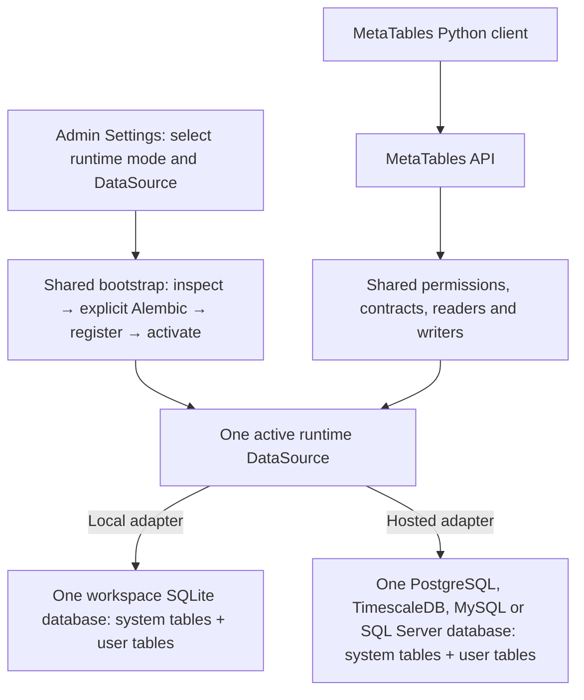

# Architecture and glossary

MetaTables makes physical database tables discoverable and usable through a
catalog with explicit identity, contracts, and permissions. It has two principal
surfaces: the installed Python client and the MetaTables API.

**Local and hosted use one execution and initialization path. Each API instance
selects one runtime DataSource containing its system catalog and default table storage.**

Before activation, Settings and the bootstrap API work without catalog tables.
Startup never runs migrations. Both modes require the same explicit initialization
action, or selection of an existing compatible database. Changing a DataSource replaces
the complete binding; no independent catalog setting can point elsewhere.

| Runtime | Selected database | Initialization |
| --- | --- | --- |
| Local | One SQLite file per workspace | Explicit system Alembic action, then source registration. |
| Hosted | PostgreSQL, TimescaleDB, MySQL or SQL Server | The same action and source registration. |

Additional registrations are candidates for a future complete runtime selection.
Table operations require the selected DataSource UID. SQLite is restricted to the
local runtime. The client resources, HTTP endpoints and workflow services are
shared; a registry binds one `DatabaseBackend` with `catalog`, `tables` and `sql`
interfaces. Engine adapters own connections, SQL syntax and migration mechanics.
SQLite physical work borrows the request transaction through savepoints. The
shared operation journal records physical effects that commit separately from
catalog changes, including nontransactional DDL in the same database.

The API uses FastAPI for HTTP and SQLAlchemy/Alembic for its catalog. The client
also uses SQLAlchemy to describe the user's application tables.

| Concept | Meaning |
| --- | --- |
| Catalog | System tables for resources, contracts, grants, membership, updates and operations, stored in the runtime DataSource. |
| Physical table | The relation containing application rows, identified by a DataSource, SQL schema, and table name. |
| DataSource | The API-selected physical storage binding. Sources are registered in the API catalog; credentials reference the runtime CredentialStore (local encrypted catalog records or hosted SDK Secrets). Local workspaces register API-owned SQLite files. |
| Local workspace | A checkout with one SQLite runtime database shared by its Git branches. MetaTables owns its selection and credentials. |
| Runtime binding | The selected mode and DataSource containing the system catalog and default application tables. |
| MetaTable | A catalog identity bound to a physical table and its relational contract. |
| SQLAlchemy authoring model | A user-defined class describing the shape and metadata of an application table. |
| Table contract | A versioned description of physical binding, columns, indexes, foreign keys, and optional time-index metadata. |
| TimeIndexMetaTable | A MetaTable whose rows have an ordered time-first observation coordinate. |
| TimeIndexTableUpdater | Python logic that produces incremental rows for an existing time-index table. |
| Update node | A catalog record for one configured producer and its output table. The client resource is `TimeIndexTableUpdate`. |
| Update details | The updater's current mutable execution state and statistics. |
| Run | One recorded updater execution with its own UID, timing, outcome, and logs. |
| Root run and execution graph | One invocation's identity and saved dependency/table topology, linked to its dependency attempts. See [Runs and execution graphs](runs-and-execution-graphs.md). |
| TimeIndexTableRef | A read-only reference to existing output; it does not construct or execute its producer. |
| Migration provider | A selected Alembic stream, table models, metadata, and catalog registry binding. |
| Physical-operation journal | Durable records used to coordinate catalog and physical effects when catalog and physical effects commit separately. |

## Three representations of a table

A user defines `class Account(PlatformManagedMetaTable, Base)` to author storage.
After registration, `metatables.MetaTable` represents its HTTP resource. Inside
the service, `metatables.api.backend.persistence.models.MetaTable` is the catalog ORM row.
They describe the same resource at different boundaries; they are not interchangeable.
Client applications import `metatables`, not the API persistence models.

## Ownership

The SDK owns platform authentication, identity, independent Git source facts,
platform Secret access and caller-proof verification. DataSource registration belongs to this API.
MetaTables owns catalog grants, resource authorization, table contracts,
SQL execution, schema lifecycle, update orchestration, and local storage engines.

The [Security model](../security/index.md) separates application administration
from Reader/Writer table ownership. The platform supplies current admin and Team
facts through the SDK; MetaTables evaluates its own grants with live namespace
inheritance. The API enforces the same rules in both runtimes.

All ordinary reads and writes go through the API. Application migrations run
Alembic in the application's client process using the selected environment's
configured database connection and existing DDL privileges. The API authorizes
catalog participation, reserves tables and finalizes physical contracts. Providers
declare the dialects their scripts support. System migrations run explicitly in
Settings. See [ADR 0013](../adr/api/0013-application-owned-migrations.md).

There are two migration histories: **catalog migrations** evolve the service's
own database; **application-table migrations** evolve a user's tables through a
selected provider. Neither substitutes for the other.
