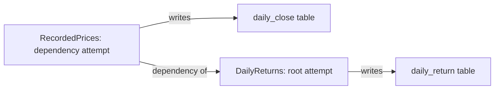

# Runs and execution graphs

A **run** records one execution of a configured updater. Running the same updater
again creates a different run, even on the same day or with the same input data.
An updater definition answers **what produces this table?** A run answers
**what happened when that producer was executed?**

## Definitions, attempts, and invocations

| Concept | Meaning |
| --- | --- |
| Updater definition | A `TimeIndexTableUpdate`: one configured producer, its output table, and its declared dependencies. It persists across executions. |
| Run / attempt | A `TableUpdateRun`: one execution of one updater, with its own UID, timestamps, result, and log correlation. |
| Root run | The attempt for the updater invoked by the user or job. It also identifies the complete invocation, including dependency execution. |
| Dependency attempt | An attempt executed as part of the root invocation. It has its own run UID and links to the root run UID. |
| Historical execution graph | The plan saved for that root invocation, plus each updater node's recorded execution state. |
| Definition graph | The currently registered updater/table relationships. These can change and do not describe a particular execution. |

The graph is an extension of existing run history, not a separate scheduling or
job system. A root invocation containing no executable dependencies still has a
valid graph: its updater and output table.

## Example: prices, returns, and volatility

The tutorial's `DailyReturns` updater depends on `RecordedPrices`.
`RecordedPrices` writes `daily_close`; `DailyReturns` writes `daily_return`.
The tutorial also has a `RollingVolatility` updater that depends on that same
configured `DailyReturns` producer and writes `rolling_volatility`.

Calling `DailyReturns` at 09:00 creates a root run and, when dependency execution
is enabled, an attempt for `RecordedPrices`. Calling it again at 14:00 creates
new run UIDs and a new saved graph. The 14:00 result never replaces the 09:00
result. If the later price update fails, that invocation can show `RecordedPrices`
as failed and `DailyReturns` as blocked while the earlier graph remains successful.

The tutorial selects its root per invocation with `--root returns` or
`--root volatility`. Invoking volatility makes returns a dependency attempt;
invoking returns makes it the root attempt. This does not change the return
producer's definition or identity. The example calls only the chosen root's
`run()` and lets the library execute dependencies and record node states.

The return updater raises a simulated error with 50% probability per calculation
attempt. With a returns root, that node fails. With a volatility root, the failed
returns dependency blocks volatility before calculation. Both invocations fail;
earlier successful graphs and published observations remain available. Successful
repeats can be empty updates because the recorded fixture is finite.

Edges distinguish updater dependencies, explicitly declared table inputs
(`reads`), and updater outputs (`writes`). A table node represents input/output
context. It is not an attempt and has no success or failure state of its own.
Foreign keys do not create updater dependencies. A read-only `TimeIndexTableRef`
adds a table input without scheduling that table's producer.

## What a run captures

Before calculation starts, the client submits the invocation's dependency plan
through the API. The API validates and saves its updater/table identities, labels,
edges, and execution options. That topology remains fixed. As work progresses,
the API records states and timing against the nodes of that same graph.

| Node state | Meaning in this invocation |
| --- | --- |
| Pending | Planned work has not started. |
| Running | Calculation started, with no recorded completion yet. Admin labels this “Started · unfinished.” |
| Succeeded | This attempt completed successfully, including a successful empty update. |
| Failed | This attempt failed. |
| Blocked | A dependency failed before this updater could calculate. |
| Skipped | The executor explicitly skipped calculation and recorded why. |
| Not run | The invocation ended before reaching this planned work. |

The root run's duration includes dependency execution. The root updater node's
calculation timestamps describe its own work. Those durations need not match.
An unfinished run records the last reported progress; it does not prove that a
process is still alive. Missing logs do not imply success, failure, or a skip.

The snapshot contains execution metadata, **not a snapshot of table rows**.
Changing an updater's definition later does not rewrite its historical graph.
Current table permissions still apply: inaccessible nodes are omitted and the
graph is marked partial. Records created without graph capture show
**Historical graph unavailable** rather than reconstructing old topology from
today's definitions.

## Runs in Admin

**Runs** lists recorded attempts by default. Use **Attempts → Root invocations**
to restrict history to roots. The compact history on the left identifies each
run by date/time, source updater, outcome indicator, and duration. Selecting a row
shows that Run's UID, timestamps, outcome and duration on the right. The updater
is metadata, and dependency attempts have a separate **Parent execution** action.
The saved graph supplies execution context; its root's identity and metrics do
not replace the selected record's summary or actions. Filter by updater, outcome,
or start time. Each attempt remains separate, even within the same invocation;
dependency attempts are indented under their root when both are listed.
History can be collapsed to give the run the full width without changing the
selected run.

A table's **Updates** tab lists attempts by producers of that table. An updater's
**Historical Updates** tab lists its attempts. These include executions made as
dependencies of another root: selecting one shows its root invocation with that
attempt's row highlighted.

The **Invocation** timeline draws the saved graph on the invocation's clock: one
row per updater attempt, dependencies first, with the attempt record, the reported
calculation and the wait for dependencies. Log events sit on their attempt's row.
Selecting a row opens that attempt. **Lineage graph** shows the saved table and
updater topology on demand. **Logs** below reads the whole invocation in time
order, or **This attempt** only, and remains visible when history is collapsed.
Refresh preserves the selected run. The run is retained in the URL, so sharing or
reopening it identifies the same execution.

## Ownership and logs

Main Sequence Jobs decides **when to invoke** application code. The MetaTables
client executes updater dependencies and reports progress; the MetaTables API
stores the run history. One platform job may produce several MetaTables root runs,
and a local Python invocation needs no platform job.

Logs belong to exact attempt run UIDs, with a shared execution UUID for correlation
across an invocation. They are read separately from the graph, per attempt or
merged across the invocation's attempts. Local runtime
captures structured logs in files; hosted capture uses platform logging through
the SDK. Expired logs do not erase the saved graph or recorded outcome.

For filters, API examples, retention limitations, and operational details, see
[Run history and graphs](../operations/run-history.md) and
[Run logs](../operations/run-logs.md). For producer authoring, see
[Build an updater](../client/build-an-updater.md).
